# HBase

## 1. 简介

* 基于Google Bigtable的开源实现；
* 分布式、可伸缩；
* 列式储存（**有争议，我认为不是，见下文**）；
* 基于HDFS；
* 不支持RDBMS的一些高级特性，如事务机制，第二索引，高级查询语言；
* 强读写一致性；
* 自动切分数据；
* RegionServer自动失效备援；
* 数十亿行 \* 数百万列 \* 数千个版本 = TB或PB级的储存


关于 Bigtable是否为列式存储有一定争议，我认为**不是**。


维基百科定义：

* **列式数据**库是以列相关存储架构进行数据存储的数据库，主要适合于批量数据处理（OLAP）和即时查询。
* 相对应的是**行式数据库**，数据以行相关的存储体系架构进行空间分配，主要适合于小批量的数据处理，常用于联机事务型数据处理（OLTP）。

HBase 有这么一个介绍：_HBase is a **column-oriented** database management system that runs on top of Hadoop Distributed File System \(HDFS\)。_由于翻译不当，所以被误认为 HBase 是列式存储数据库。应当翻译为 HBase 是运行在 HDFS 之上的**面向列**的数据库管理系统

HBase 底层存储的数据结构为 LSM（Log-Structured Merge-Tree），即不是列式存储，也不是行式存储，而是面向列族的。如下图：


那么，HBase 底层存储大致如下：


* 不同的列族存在不同的文件中。
* 整个数据是按照 Rowkey 进行字典排序的。
* 每一列数据在底层 HFile 中是以 KV 形式存储的。
* 相同的一行数据中，如果列族也一样，那么这些数据是顺序放在一起的。
* 不同行相同的列族数据是相邻存储的，同一行不同列族的数据是存储在不同位置的。

列式存储的优点：

* 更容易压缩：列式存储把一列的数据放在一起存储，同一列的数据往往类型是一样的，更容易压缩。
* 更适合 OLAP：OLTP 通常对数据记录进行增删查改，所以行式存储更适合；但是 OLAP 一般对大量数据进行汇总和分析，更适合列式存储。

## 2. 数据模型

[Google Bigtable Paper](https://research.google.com/archive/bigtable.html)中对Bigtable的定义：

> A Bigtable is a sparse, distributed, persistent multidimensional sorted map.
>
> The map is indexed by a row key, column key, and a timestamp; each value in the map is an uninterpreted array of bytes.

HBase的数据模型非常相似：

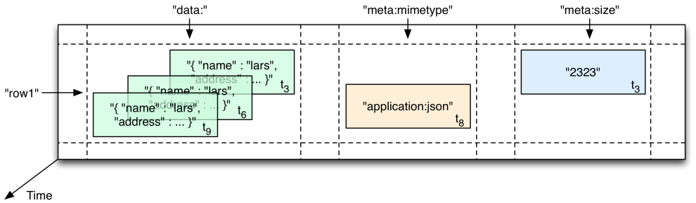

* **表\(table\)：**一张表有多行。
* **行\(row\)：**一行包括一个行健\(row key\)，多个列族\(column family\)，一张表中按照行健排序，以行健为索引。如，row1。
* **列族\(column family\)：**每个列族包含多个列\(column\)，需要在建表时定义好。如data、meta。
* **列\(column\)：**每个列都属于某一个列族，以 列族名:列名\(column qualifier\) 表示。如 meta:minetype。
* **版本\(version\)：**默认是时间戳。
* **单元格\(cell\)：**由\[行，列，版本号\]来唯一确定。

```text
{
  // ...
  "row1" : {
    "family1" : {
      "column1" : {
        timestamp2 : "value1",
        timestamp3 : "value2"
        },
      "column2" : {timestamp : "value3"}
    },
    "family2" : { ... }
  },
  "row2" : {
    "family3" : { ... }
  },
  // ...
}
```

官方例子：

| Row Key | Time Stamp | Family contents | Family anchor | Family people |
| :--- | :--- | :--- | :--- | :--- |
| "com.cnn.www" | t9 |  | anchor:cnnsi.com = "CNN" |  |
| "com.cnn.www" | t8 |  | anchor:my.look.ca = "CNN.com" |  |
| "com.cnn.www" | t6 | contents:html = "&lt;html&gt;… |  |  |
| "com.cnn.www" | t5 | contents:html = "&lt;html&gt;… |  |  |
| "com.cnn.www" | t3 | contents:html = "&lt;html&gt;… |  |  |
| "com.example.www" | t5 | contents:html = "&lt;html&gt;… |  | people:author: "John Doe" |

> 表格中的空白单元不会占用物理存储空间，只是概念上存在

## 3. 安装

hbase有Standalone、Pseudo-Distributed（伪分布式）、Fully Distributed（分布式）三种部署方式；

### 3.1. Standalone安装

**Standalone**模式在单节点运行，且所有的daemon（HMaster, HRegionServer, and ZooKeeper）都在一个 JVM 进程中运行；

* [**下载**](http://www.apache.org/dyn/closer.cgi/hbase/) **HBase，建议下载stable版本；**
* **解压并移动目录；**

```text
$ tar -xzvf hbase-1.2.6-bin.tar.gz
$ mv hbase-1.2.6 /usr/local/hbase
```

* **配置JAVA\_HOME环境变量**

```text
$ cd /usr/local/hbase
$ vi conf/hbase-env.sh
export JAVA_HOME=`/usr/libexec/java_home -v 1.8`
```

* **配置hbase-site.xml**

配置属性 hbase.rootdir，file表示使用本地文件系统作为hbase的数据储存，指定hdfs://namenode.example.org:8020/hbase可以指定HDFS作为储存介质；

```text
$ vi conf/hbase-site.xml
​
<configuration>
  <property>
    <name>hbase.rootdir</name>
    <value>file:///usr/local/hbase/data</value>
  </property>
  <property>
    <name>hbase.zookeeper.property.dataDir</name>
    <value>/usr/local/hbase/zookeeper</value>
  </property>
</configuration>
```

* **启动hbase**

```text
$ bin/start-hbase.sh
```

* **确认hbase已经启动，访问** [**http://localhost:16010**](http://localhost:16010)
* **连接hbase**

quit可以退出shell；

```text
$ bin/hbase shell
```

* **关闭hbase服务**

```text
$ bin/stop-hbase.sh
```

### 3.2. 伪分布式安装

**伪分布式**模式也是在单个节点运行，但是daemon（HMaster, HRegionServer, and ZooKeeper）分别在不同的jvm进程中；

[安装方法](http://hbase.apache.org/book.html#quickstart_pseudo)

启动多个master

```text
bin/local-master-backup.sh start 2 3 4
```

启动多个regionserver

```text
bin/local-regionservers.sh start 2 3 4
```

查看端口占用

```text
lsof -nP -iTCP -sTCP:LISTEN
```

[webUI](localhost:16010)

### 3.3. 分布式安装

**分布式**模式在多个节点中运行，集群有多个节点，每个节点运行一个或多个HBase的daemon，包括主、副Master节点，多个Zookeeper节点，多个RegionServer节点；

[安装方法](http://hbase.apache.org/book.html#quickstart_fully_distributed)

## 4. 操作

**HBase Shell**是一个Ruby脚本，可以操作HBase数据；

HBase是java写的，所以提供了**java API**，是访问HBase最快的方式；

### 4.1. 连接

连接

```text
$ cd /usr/local/hbase
​
$ bin/hbase shell
​
SLF4J: Class path contains multiple SLF4J bindings.
SLF4J: Found binding in [jar:file:/usr/local/hbase/lib/slf4j-log4j12-1.7.5.jar!/org/slf4j/impl/StaticLoggerBinder.class]
SLF4J: Found binding in [jar:file:/usr/local/hadoop/share/hadoop/common/lib/slf4j-log4j12-1.7.10.jar!/org/slf4j/impl/StaticLoggerBinder.class]
SLF4J: See http://www.slf4j.org/codes.html#multiple_bindings for an explanation.
SLF4J: Actual binding is of type [org.slf4j.impl.Log4jLoggerFactory]
HBase Shell; enter 'help<RETURN>' for list of supported commands.
Type "exit<RETURN>" to leave the HBase Shell
Version 1.2.6, rUnknown, Mon May 29 02:25:32 CDT 2017
​
hbase(main):001:0>
```

退出

```text
hbase(main):001:0> exit
```

java API

```text
Configuration conf = HBaseConfiguration.create();
conf.set(HConstants.ZOOKEEPER_QUORUM, "172.16.233.78");
try {
    Connection conn = ConnectionFactory.createConnection(conf);
    Admin admin = conn.getAdmin();
}finally {
    if (conn!=null && !conn.isClosed()) {
        conn.close();
    }
}
```

### 4.2 General Command

**status**

```text
hbase(main):002:0> status
1 active master, 0 backup masters, 1 servers, 0 dead, 3.0000 average load
```

**version**

```text
hbase(main):005:0> version
1.2.6, rUnknown, Mon May 29 02:25:32 CDT 2017
```

**table\_help**

```text
hbase(main):007:0> table_help
```

**whoami**

```text
hbase(main):008:0> whoami
zhaoyun (auth:SIMPLE)
    groups: staff, everyone, localaccounts, _appserverusr, admin, _appserveradm, _lpadmin, com.apple.sharepoint.group.1, _appstore, _lpoperator, _developer, com.apple.access_ftp, com.apple.access_screensharing, com.apple.access_ssh-disabled
```

### 4.3 Table Operation

**Create Table**

创建一个名为element的表，含量两个列族，分别为base和ext；

```text
hbase(main):021:0> create 'element' , 'base', 'ext'
```

java API

```text
HTableDescriptor tableDescriptor = new HTableDescriptor(TableName.valueOf("element"));
tableDescriptor.addFamily(new HColumnDescriptor("base"));
tableDescriptor.addFamily(new HColumnDescriptor("ext"));
admin.createTable(tableDescriptor);
```

**List Table**

```text
hbase(main):021:0> list
```

java API

```text
HTableDescriptor[] tables = admin.listTables();
```

**Disable Table**

若要删除或者修改一个表，先需要disable它；

```text
hbase(main):021:0> disable 'element'
​
hbase(main):030:0> is_disabled 'element'
​
hbase(main):032:0> disable_all 'e.*'
```

java API

```text
if (!admin.isTableDisabled(TableName.valueOf("element"))) {
    admin.disableTable(TableName.valueOf("element"));
}
```

**Enable Table**

```text
hbase(main):021:0> enable 'element'
​
hbase(main):021:0> is_enabled 'element'
```

java API

```text
if (!admin.isTableEnabled(TableName.valueOf("element"))) {
    admin.enableTable(TableName.valueOf("element"));
}
```

**Describe Table**

```text
hbase(main):021:0> describe 'element'
​
Table element is ENABLED
element
COLUMN FAMILIES DESCRIPTION
{NAME => 'base', BLOOMFILTER => 'ROW', VERSIONS => '1', IN_MEMORY => 'false', KEEP_DELETED_CELLS => 'FALSE', DATA_BLOCK_ENCODING => 'NONE', TTL => 'FOREVER', COMPRESSION => 'NONE', MIN_VERSIONS => '0',
BLOCKCACHE => 'true', BLOCKSIZE => '65536', REPLICATION_SCOPE => '0'}
{NAME => 'ext', BLOOMFILTER => 'ROW', VERSIONS => '1', IN_MEMORY => 'false', KEEP_DELETED_CELLS => 'FALSE', DATA_BLOCK_ENCODING => 'NONE', TTL => 'FOREVER', COMPRESSION => 'NONE', MIN_VERSIONS => '0', B
LOCKCACHE => 'true', BLOCKSIZE => '65536', REPLICATION_SCOPE => '0'}
```

**Alter Table**

```text
# 把element表的base列族的VERSIONS属性设为5
hbase(main):021:0> alter 'element', NAME => 'base', VERSIONS => 5
​
hbase(main):021:0> alter 'element' , READONLY
​
hbase(main):021:0> alter 'element', METHOD => 'table_att_unset',NAME => 'MAX_FILESIZE'
​
# 删除列族ext
hbase(main):021:0> alter 'element', 'delete' => 'ext'
```

java API

```text
admin.addColumn(TableName.valueOf("element"), new HColumnDescriptor("newColFamily"));
admin.deleteColumn(TableName.valueOf("element"), "newColFamily".getBytes());
```

**Exists**

```text
hbase(main):021:0> exists 'element'
​
Table element does exist
```

java API

```text
boolean exists = admin.tableExists(TableName.valueOf("element"));
```

**Drop Table**

在删除一个表时，先必须disable它；

```text
hbase(main):021:0> drop 'element'
​
hbase(main):021:0> drop_all 'ele.*'
```

java API

```text
if (!admin.isTableDisabled(TableName.valueOf("element"))) {
    admin.disableTable(TableName.valueOf("element"));
}
admin.deleteTable(TableName.valueOf("element"));
```

### 4.4 Data Operation

**Scan**

```text
hbase(main):021:0> scan 'element'
```

**Create Data**

向element表的第1行的base列族添加elementId列，值设为1234；

```text
hbase(main):021:0> put 'element', '1', 'base:elementId','1234'
```

java API

```text
Table table = conn.getTable(TableName.valueOf("element"));
Put put = new Put("1".getBytes());
put.addColumn("base".getBytes(), "elementId".getBytes(), "1234".getBytes());
table.put(put);
table.close();
```

**Update Data**

把element表的第1行的base列族的elementId列的值更新为12345；

```text
hbase(main):021:0> put 'element', '1', 'base:elementId','12345'
```

java API

```text
Table table = conn.getTable(TableName.valueOf("element"));
Put put = new Put("1".getBytes());
put.addColumn("base".getBytes(), "elementId".getBytes(), "12345".getBytes());
table.put(put);
table.close();
```

**Read Data**

```text
hbase(main):021:0> get 'element' , '1'
​
COLUMN                                              CELL
 base:elementId                                     timestamp=1501833865714, value=12345
```

java API

```text
Table table = conn.getTable(TableName.valueOf("element"));
Get get = new Get("1".getBytes());
Result result = table.get(get);
table.close();
```

**Delete Data**

```text
# delete a cell
hbase(main):021:0> delete 'element', '1','base:elementId'
​
# delete a row
hbase(main):021:0> delete 'element', '1'
```

java API

```text
Table table = conn.getTable(TableName.valueOf("element"));
Delete delete = new Delete("1".getBytes());
delete.addColumn("base".getBytes(), "elementId".getBytes());
table.delete(delete);
table.close();
```

**Count**

```text
hbase(main):021:0> count 'element'
```

**Truncate**

```text
hbase(main):021:0> truncate 'element'
```

### 4.5 过滤器

HBase主要的数据读取函数是get\(\)和scan\(\)，它们都是指定行健来访问数据。可以在查询中添加更多的限制条件（**过滤器**）来减少查询得到的数据量。

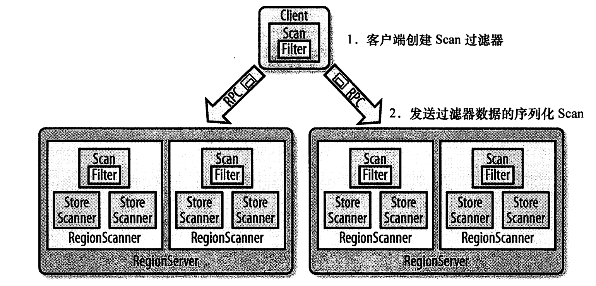

> 过滤器在客户端创建，通过RPC传送到服务端，然后在服务端执行过滤操作。

比较过滤器、列族过滤器、列名过滤器、值过滤器、时间戳过滤器、自定义过滤器。。。

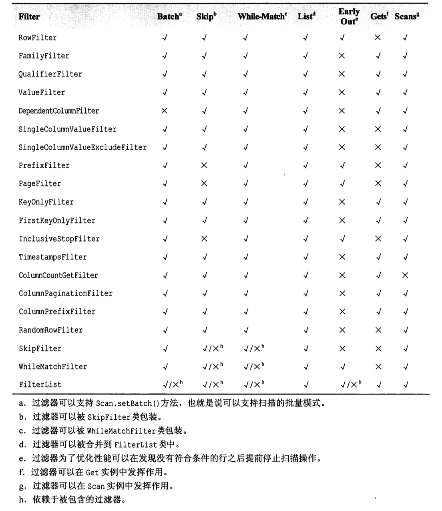

### 4.6 协处理器

coprocessor，可以让用户把一部分计算移动到数据存放端（RegionServer）。

数据的处理流程直接放到服务器上执行，然后返回一个小的处理结果集。类似于一个MapReduce框架，将工作分发到整个集群。

协处理器在每个region中按照顺序执行。

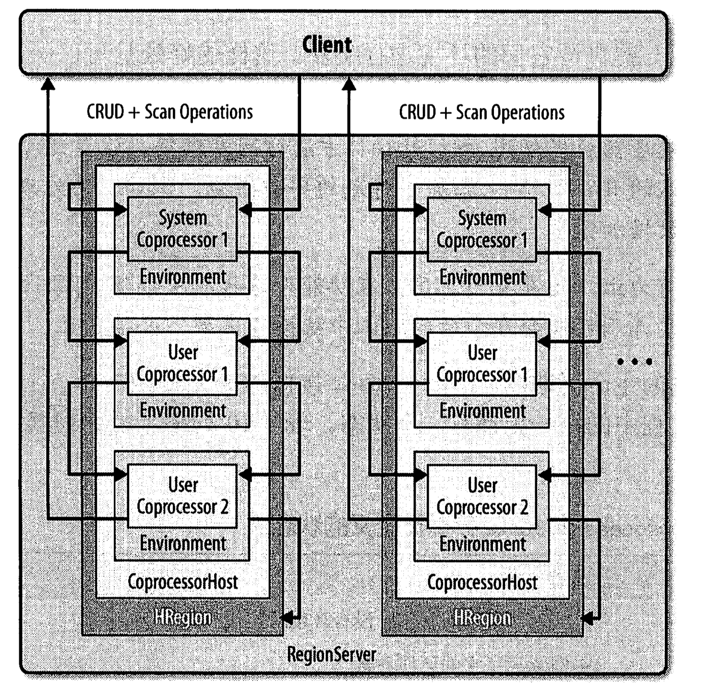

### 4.7 Phoenix

[phoenix](https://phoenix.apache.org/index.html)把SQL语句编译成HBase API，提供二级索引等功能。

[Apache Phoenix与HBase：HBase之上SQL的过去，现在和未来](https://yq.aliyun.com/articles/71097?spm=5176.100239.blogcont169085.19.iO0Bnk)

## 5. 架构

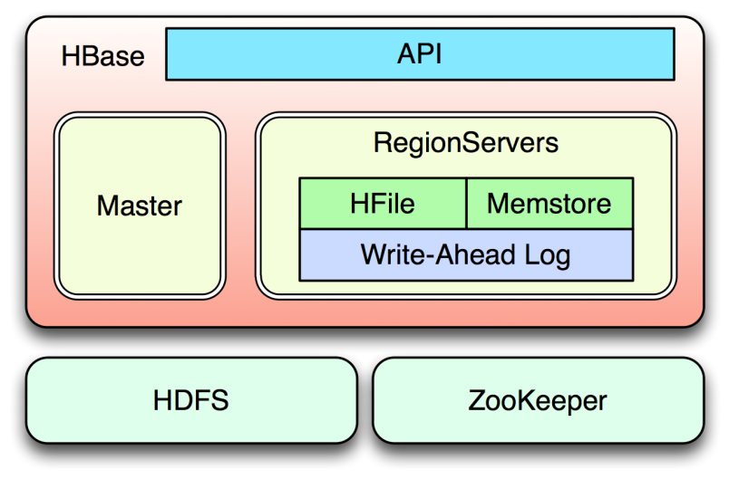

* **HMaster：**负责监控集群、管理RegionServers的负责均衡等，可以用主-备形式部署多个Master。
* **HRegionServer：**负责响应用户的I/O操作请求，客户端对HBase读写数据是与RegionServer交互。
* **Zookeeper：**负责选举Master的主节点；服务注册；保存RegionServers的状态等。可以使用系统内建的zookeeper，也可以使用独立的zookeeper。
* **HDFS：**真正的数据持久层，并非必须是HDFS文件系统，但搭配HDFS是最佳选择，也是目前应用最广泛的选择。

### 5.1 hbase:meta

* 所有的region信息；
* 保存在Zookeeper中；

### 5.2 HMaster

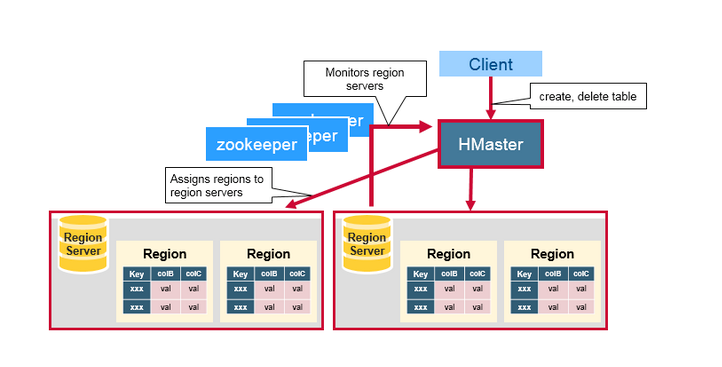

* 分配Region：1、启动时；2、RegionServer失效时；3、Region切分时；
* 监控集群中的所有RegionServer，实现其负载均衡；
* DDL：表格的创建、删除和更新-列族的更新；
* HDFS上的垃圾文件回收；

### 5.3 RegionServer

HRegionServer是HBase中最主要的组件，负责table数据的实际读写，管理Region。

在分布式集群中，HRegionServer一般跟DataNode在同一个节点上，目的是实现数据的本地性，提高读写效率。

* 响应client的读写请求，进行I/O操作（直接绕过HMaster）；
* 与HDFS交互，管理table数据；
* 当Region的大小到达阀值时切分Region；

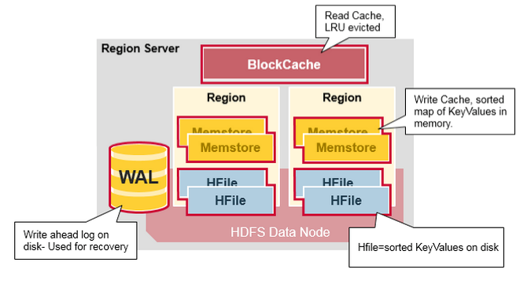

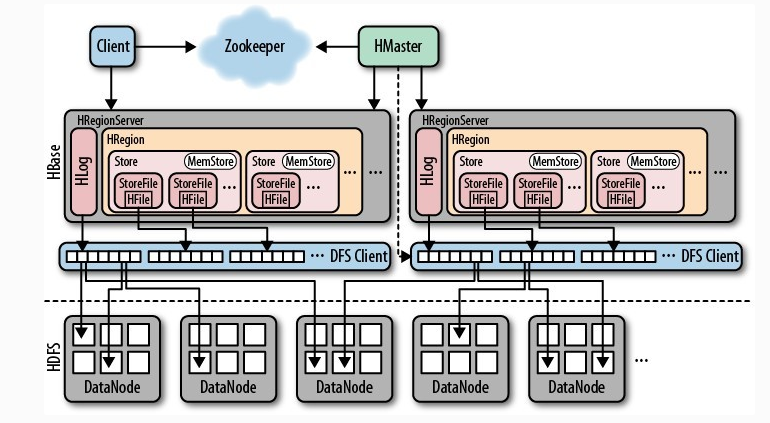

#### **5.3.1 功能**

* 定期向Master汇报；
* 管理Region，执行Flush、Compaction、Open、Close、Load等操作；
* 管理WAL；
* 执行数据插入、更新和删除操作；

#### **5.3.2 组件**

**5.3.2.1 WAL: Write Ahead Log**

* 记录RegionServer上的所有编辑信息（Puts/Deletes操作，属于哪个Region），在写到memstore之前；
* 用于RegionServer失效时，通过Replay恢复RegionServer上memstore中尚未持久化的数据；

**5.3.2.2 MemStore**

* 是Region中的重要组成部分；
* 写缓存；
* 数据先写到MemStore，flush触发后刷新到磁盘；
* KeyValue的形式；

**5.3.2.3 BlockCache**

* 读缓存；
* 每个RegionServer中只有一个BlockCache实例；

**5.3.2.4 Region**

* [region的层级结构](http://hbase.apache.org/book.html#regions.arch)
* HBase表格根据row key 划分成“Regions”；
* 一个Region包含该表格中从起始key到结束key之间的所有行；
* 当Region的大小达到指定的阀值时，RegionServer会执行Region的切分，分裂执行完毕后，会将子Region添加到hbase:meta并且汇报给Master；

> 可以预建分区以减少Region切分

* [HFile文件结构](http://cloudepr.blogspot.hk/2009/09/hfile-block-indexed-file-format-to.html)

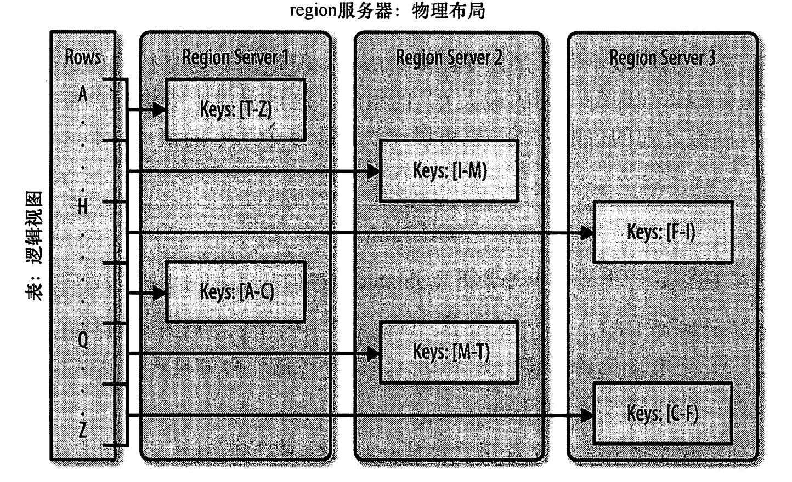

#### **5.3.3 流程**

**5.3.3.1 初始化**

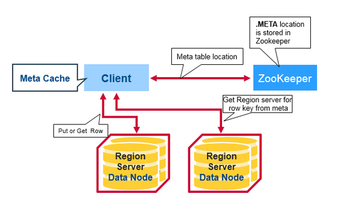

* Client从ZooKeeper中读取hbase:meta表；
* Clinet从hbase:meta获取想要操作的Region的位置信息，缓存；
* Client向目标Region所在的RegionServer发送请求，执行操作；
* 当一个region因为Master执行负载均衡或者RegionServer挂掉而执行的重定位之后，Client需要重新读取hbase:meta进行缓存；

**5.3.3.2 写**

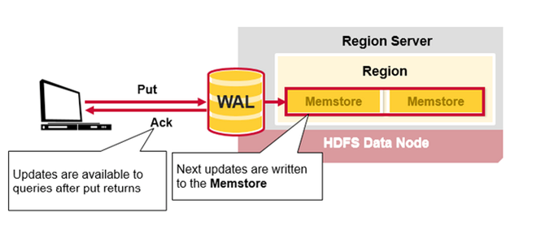

* Client提交一个Put请求到RegionServer，数据首先会写到WAL中；
* 当数据写到WAL之后，数据会写到MemStore中，等待刷新到磁盘中；
* 数据写到MemStore完成之后，RS会给Client发送确认信息；

**5.3.3.3 读**

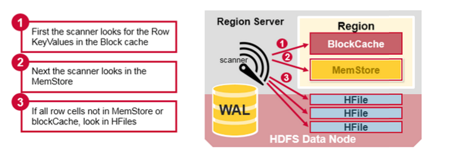

* 首先扫描BlockCache（读缓存）中寻找row cell；
* 若没有，扫描MemStore（写缓存）中寻找row cell；
* 若没有，HBase会使用BlockCache索引和bloom filters来加载那包含目标row cells的HFile到内存；

### 5.4 Zookeeper

* 存储hbase:meta，即所有Region的位置信息；
* 存储HBase中表格的元数据信息；
* ZooKeeper集群本身使用一致性协议\(PAXOS协议\)保证每个节点状态的一致性；
* 保证集群中有且只有一个HMaster为Active；

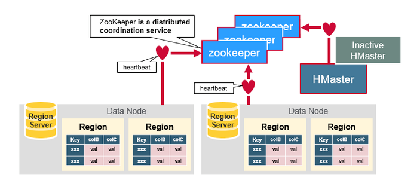

## 6. FAQ

### HBase与Hive的对比

|  | HBase | Hive |
| :--- | :--- | :--- |
| 类型 | 列式数据库 | 数据仓库 |
| 内部机制 | 数据库引擎 | MapReduce |
| 增删改查 | 都支持 | 只支持导入和查询 |
| Schema | 只需要预先定义列族，不需要具体到列列可以动态修改 | 需要预先定义表格 |
| 应用场景 | 实时 | 离线处理 |
| 特点 | 以K-V形式存储 | 类SQL |

### HRegionServer宕机如何处理

* ZooKeeper会监控HRegionServer的上下线情况，当ZK发现某个HRegionServer宕机之后会通知HMaster；
* 该HRegionServer会停止对外提供服务，就是它所负责的region暂时停止对外提供服务；
* HMaster会将该HRegionServer所负责的region转移到其他HRegionServer上，并且会对HRegionServer上存在memstore中还未持久化到磁盘中的数据进行恢复；
* 这个恢复的工作是由WAL replay来完成；

## 总结

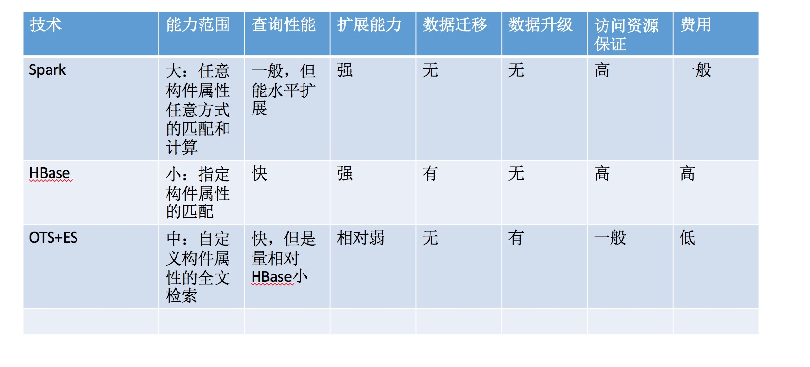

## 参考文献

* [https://research.google.com/archive/bigtable.html](https://research.google.com/archive/bigtable.html)
* [http://hbase.apache.org/book.html\#faq](http://hbase.apache.org/book.html#faq)
* [https://phoenix.apache.org/index.html](https://phoenix.apache.org/index.html)
* [https://mapr.com/blog/in-depth-look-hbase-architecture/\#.VdMxvWSqqko](https://mapr.com/blog/in-depth-look-hbase-architecture/#.VdMxvWSqqko)
* [http://cloudepr.blogspot.hk/2009/09/hfile-block-indexed-file-format-to.html](http://cloudepr.blogspot.hk/2009/09/hfile-block-indexed-file-format-to.html)

