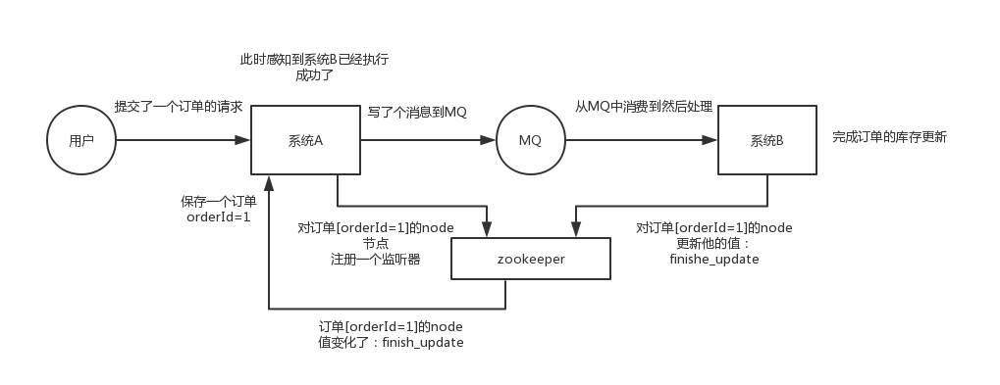

# ZooKeeper

## 分布式协调

A 系统发送个请求到 mq，然后 B 消息消费之后处理了。那 A 系统如何知道 B 系统的处理结果？

**解决方式**：A 系统发送请求之后可以在 zk 上对某个节点的值注册个监听器，一旦 B 系统处理完了就修改 zk 那个节点的值，A 立马就可以收到通知。

## 分布式锁

## 元数据/配置信息管理

Kafka、Storm、Dubbo 等很多分布式系统都会选用 zk 来做一些元数据、配置信息的管理。

## HA 

Hadoop、HDFS、Yarn 等很多大数据系统，都选择基于 zk 来开发 HA 高可用机制。原理：一个重要进程一般会做主备两个，主进程挂了立马通过 zk 感知到切换到备用进程。

