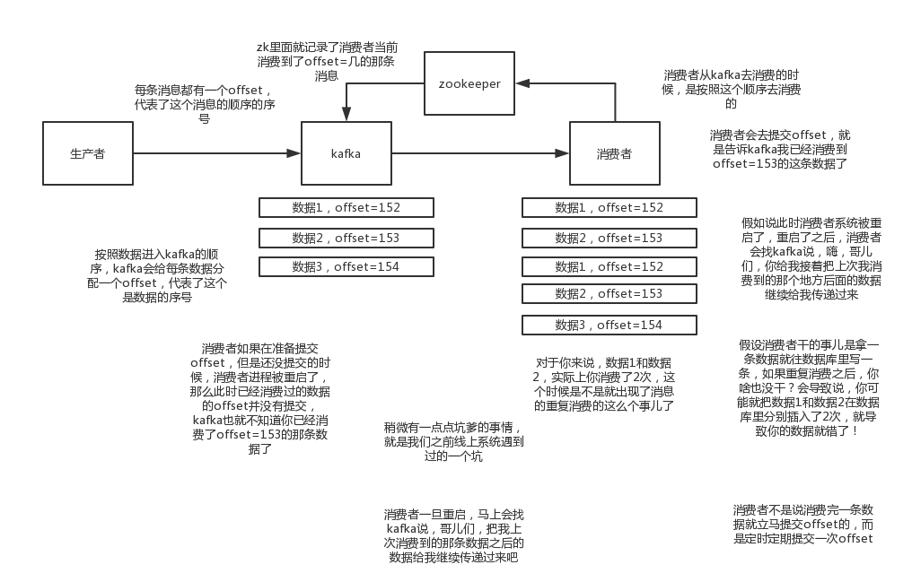

# Message Queue

## 1. 介绍

### 1.1 使用场景

消息队列是分布式系统中的重要组件，主要用于解决什么问题呢？后者说为什么要使用消息队列？

**解耦：**如果一个系统A，调用了多个系统BCD。可能有新的系统E需要调用，老的系统D不再需要调用等情况。系统A还需要考虑C挂掉怎么办？需不需要重新调用？维护起来很麻烦。如果这个调用是不需要同步调用的，那么可以用MQ给他异步化解耦。

**异步：**引入消息队列，将不是必须的业务逻辑异步处理，可以显著提高系统吞吐量。

**削峰：**可以缓解短时间内高流量压垮应用**，**比如秒杀活动。

### 1.2 缺点

引入消息队列可以有上述这么多作用，但是也会带来一些问题。

**可用性降低：**系统引入的外部依赖越多，越容易挂掉。本来系统A调用BCD即可，现在加入MQ，若MQ挂了，整个系统就崩溃了。

**系统复杂度提高：**引入MQ就需要考虑MQ的问题。怎么保证消息没有重复消费？怎么处理消息丢失的情况？怎么保证消息传递的顺序性？

**一致性问题：**系统A处理完，发送消息后就返回成功的结果给用户。但是BCD收到消息后不一定能保证执行成功，若有一个系统执行失败了，整个处理结果是失败的。那么和用户得到的结果是不一致的。

### 1.3 消息队列产品比较

市面上常用的消息队列产品有ActiveMQ、RabbitMQ、RocketMQ、Kafka等。

<table>
  <thead>
    <tr>
      <th style="text-align:center">特性</th>
      <th style="text-align:center">ActiveMQ</th>
      <th style="text-align:center">RabbitMQ</th>
      <th style="text-align:center">RocketMQ</th>
      <th style="text-align:center">Kafka</th>
    </tr>
  </thead>
  <tbody>
    <tr>
      <td style="text-align:center">单机吞吐量</td>
      <td style="text-align:center">万级</td>
      <td style="text-align:center">万级</td>
      <td style="text-align:center">10万级</td>
      <td style="text-align:center">10万级</td>
    </tr>
    <tr>
      <td style="text-align:center">topic</td>
      <td style="text-align:center"></td>
      <td style="text-align:center"></td>
      <td style="text-align:center">topic可以达到几百，几千个的级别，吞吐量会有较小幅度的下降</td>
      <td style="text-align:center">
        
topic从几十个到几百个的时候，吞吐量会大幅度下降

        

      </td>
    </tr>
    <tr>
      <td style="text-align:center">时效性</td>
      <td style="text-align:center">ms级</td>
      <td style="text-align:center">us级</td>
      <td style="text-align:center">ms级</td>
      <td style="text-align:center">ms级</td>
    </tr>
    <tr>
      <td style="text-align:center">可用性</td>
      <td style="text-align:center">高，主从</td>
      <td style="text-align:center">高，主从</td>
      <td style="text-align:center">非常高，分布式</td>
      <td style="text-align:center">非常高，分布式</td>
    </tr>
    <tr>
      <td style="text-align:center">消息可靠性</td>
      <td style="text-align:center">有较低的概率丢失数据</td>
      <td style="text-align:center"></td>
      <td style="text-align:center">经过参数优化配置，可以做到0丢失</td>
      <td style="text-align:center">经过参数优化配置，消息可以做到0丢失</td>
    </tr>
    <tr>
      <td style="text-align:center">功能支持</td>
      <td style="text-align:center">MQ领域的功能极其完备</td>
      <td style="text-align:center">基于erlang开发，所以并发能力很强，性能极其好，延时很低</td>
      <td style="text-align:center">功能较为完善，还是分布式的，扩展性好</td>
      <td style="text-align:center">功能较为简单，主要支持简单的MQ功能，在大数据领域的实时计算以及日志采集被大规模使用，是事实上的标准</td>
    </tr>
  </tbody>
</table>综上所述：

**ActiveMQ：**早期都用这个，但是现在确实大家用的不多了，没经过大规模吞吐量场景的验证，社区也不是很活跃，不推荐。

**RabbitMQ：**Erlang语言阻止了大量的Java工程师去深入研究和掌控他，对公司而言，几乎处于不可控的状态，但是确实人是开源的，比较稳定的支持，活跃度也高。

**RocketMQ：**有阿里品牌保障，日处理消息上百亿之多，可以做到大规模吞吐，性能也非常好，分布式扩展也很方便。Java编写的，我们可以自己阅读源码，定制自己公司的MQ。

**Kafka：**仅仅提供较少的核心功能，但是提供超高的吞吐量，ms级的延迟，极高的可用性以及可靠性，而且分布式可以任意扩展。如果是大数据领域的实时计算、日志采集等场景，Kafka用是业内标准的，社区活跃度很高，何况几乎是全世界这个领域的事实性规范。

## 2. 高可用保证

### 2.1 主从模式

主从模式的MQ产品有ActiveMQ、RabbitMQ等。以RabbitMQ为例，有三种部署模式，单机模式、普通集群模式、镜像集群模式。

**单机模式：**Demo级别，本地启动玩玩，生产环境没人用。

**普通集群模式：**默认的集群模式，对于Queue来说，消息实体只存在于其中一个节点A，其它节点BC仅有相同的元数据。当Consumer从B拉取消息时，B会从A先拉取数据，再从B转发给Consumer。可用性没有保障，若A宕机了，没有持久化时消息直接丢失，持久化时也得等A重新启动才能工作。这个模式仅用来提高吞吐量。

**镜像集群模式：**把队列做成镜像队列，存在于多个节点，属于RabbitMQ的HA方案。其实质和普通模式不同之处在于，消息实体会主动在镜像节点间同步，而不是在Consumer取数据时临时拉取。缺点是性能开销太大，没有扩展性可言。

### 2.2 分布式模式

分布式模式的MQ产品主要有RocketMQ、Kafka等。

以Kafka为例，每个节点有一个Broker进程，每创建一个Topic会分成多个Partition，同一个Topic的Partition会分布在不同的Broker上，每个Partition有多个Replica，多个Replica会选举一个Leader。

Producer和Consumer只与Leader交互。

## 3. 消息重复消费

RabbitMQ、RocketMQ、Kafka等都会出现重复消费消息的情况，但是这不是MQ去控制的，也不能控制的，而是应该由使用者自己去处理，即保证重复消费消息的**幂等性**。

以 Kafka 为例，来说明**为何**会出现重复消费消息？
Kafka 每条消息有一个 Offset，代表他的序号，Consumer 消费了数据之后，每隔一段时间，会把自己消费过的消息的 Offset 提交给 Kafka，下次重启的时候，就从上次消费到的 Offset 继续。若消费者是不正常的重启，在重启之前没有提交 Offset 给 Kafka，那么重启后，就会出现重复消费数据。

保证消费消息**幂等性**的常见方法：

1. 数据库写入时，先根据主键查一下，若存在，则不插入，而是 Update。
2. 消息写入时，在每条消息里加入一个全局唯一的 ID，消费者拿到之后，先去 Redis 查询是否消费过。

## 4. 消息丢失

MQ 的基本原则是数据不能多也不能少，不能多就是上面讲的消息重复消费，不能少就是消息不能丢失。

消息丢失会出现在三个环节：生产者丢失数据、MQ 丢失数据、消费者丢失数据。下面分别介绍 RabbitMQ 和 Kafka 怎么解决消息丢失的问题。

### 4.1 RabbitMQ

#### 4.1.1 生产者丢失数据

生产者在把数据发送给 RabbitMQ 时，可能由于网络原因在半路丢失了。

**事务方式：**发消息前开启事务`channel.txSelect`，然后发送消息，若消息没有被 RabbitMQ 收到，则会收到异常，此时可以回滚消息`channel.txRollback`，然后重新发送，若收到了消息，则可以提交事务`channel.txCommit`。

**Confirm 方式：**生产者端开启 Confirm 模式，每次写消息会分配一个 ID，RabbitMQ 处理后会发送一个回调（`ack、nack`）给生产者。那么生产者可以在内存中维护每个消息的 ID 状态，若长时间没有收到回调，则可以再次发送。

事务方式是同步的，MQ 的吞吐量会下降。Confirm 是异步的。所以一般用 Confirm 的方式。

#### 4.1.2 MQ 丢失数据

开启持久化功能。创建 Queue 的时候设置为持久化，发送消息的时候也将消息设置为持久化（`deliveryMode = 2`），必须两个都设置才能持久化。

若在持久化还没完成，RabbitMQ 挂了，消息也会丢失，这种情况概率极低。可以和 Confirm 方式结合，只有在持久化完成之后才发送回调给生产者。

#### 4.1.3 消费者丢失数据

若消费者拿到消息后，还没来得及处理就挂了，但是 RabbitMQ 认为你已经消费完成了，这样就出现了消息丢失的情况。

关闭 RabbitMQ 的自动 ACK，通过 API 来调用，只有当消费者处理完之后，再发送给 RabbitMQ ACK。

### 4.2 Kafka

#### 4.2.1 生产者丢失数据

`acks=all`，要求每条数据，必须写入所有 Replica 之后，才能认为是写成功了。

`retries = Integer.MAX`，这个是要求一旦写入失败，就无限重试。

#### 4.2.2 MQ 丢失数据

若某个 Broker 挂了，上面的 Leader 也挂了，此时需要重新选举 Leader，而此时 Follower 刚好还有些数据没有同步完成，那么就会丢失一些数据。

设置四个参数：

1. `topic参数：replication.factor > 1`，Topic 的每个 Partition 至少有2个副本。
2. `Kafka服务端参数：min.insync.replicas > 1`，要求一个 Leader 至少感知到有至少一个 Follower 还跟自己保持联系，这样才能在 Leader 挂了之后，还有 Follower 可以选举。
3. `Producer端参数：acks = all`。
4. `Producer端参数：retries = Integer.MAX`。

#### 4.2.3 消费者丢失数据

和 RabbitMQ 类似，消费者会自动提交 Offset ，只需要关闭自动提交即可，当处理完消息后才手动提交 Offset。

