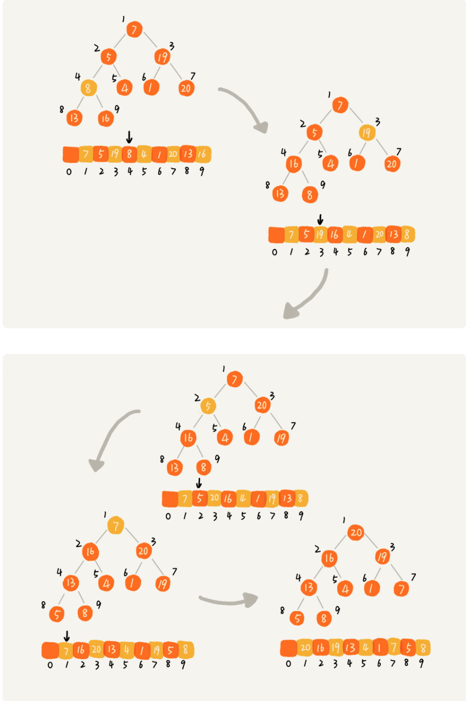

# Runtime Data Area

JVM = 类加载器\(ClassLoader\) + 执行引擎\(Execution engine\) + 运行时数据区域\(Runtime data area\) 。如下图所示：

**Runtime data area：**Java虚拟机在执行Java程序的过程中会把它所管理的内存划分为若干个不同的区域。如下图是运行时数据区域的详细结构：

### Java堆

* Java堆（Java heap）是**线程公有。**
* 原则上所有的**对象实例**都存在堆上，但是JIT与逃逸分析技术等除外。是**垃圾收集器**管理的主要区域。
* 一般来说，Java堆（Java heap）是内存中**最大**的一块。
* 虚拟机规范规定，Java堆可以处于**物理上不连续**的内存空间。
* 会抛出**OutOfMemoryError**异常。

从内存回收的角度来看，由于收集器一般采用**分代**收集的特点，所以堆一般可以细分为不同的区域。

### 方法区

* 方法区（Method area）也是**线程公有**。
* 用于存放已被加载的**类信息、常量、静态变量、即时编译器编译后的代码**等数据。
* 虚拟机规范把方法区描述为堆的一个逻辑部分
* **不需要连续**的内存空间。
* 会抛出**OutOfMemoryError**异常。


很多人把方法区称为永久代（Permanent Generation），本质上是不对的。只是因为HotSpot在1.7之前用永久代来实现方法区，但是对于其它虚拟机（JRockit等）并不存在永久代的概念。


#### 永久代与元空间

* JDK1.7之前，HotSpot 使用永久代实现方法区。 
* JDK1.7 ，HotSpot 中符号引用（Symbols）被移动到 Native Heap中，字符串常量和类引用被移动到 Java Heap中。 
* 在 JDK1.8 中，永久代已完全被**元空间\(Meatspace\)**所取代。元空间的本质和永久代类似，都是对JVM规范中方法区的实现。不过元空间与永久代之间最大的区别在于：元空间并不在虚拟机中，而是**使用本地内存**。因此，默认情况下，元空间的大小仅受本地内存限制。**​**

#### 运行时常量池

* 运行时常量池（Runtime Constant Pool）是方法区的一部分。
* Class 文件中的常量池（编译器生成的各种字面量和符号引用）会在类加载后被放入这个区域。
* 除了在编译期生成的常量，还允许动态生成，例如 String 类的 intern\(\)。这部分常量也会被放入运行时常量池。

### Java虚拟机栈

* Java虚拟机栈（VM stack）是**线程私有**。
* 生命周期与线程相同。
* 虚拟机栈描述的是**Java方法执行的内存模型**：每个方法被执行的时候都会同时创建一个**栈帧（Stack Frame）**用于存储**局部变量表、操作数栈、动态链接、方法出口**等信息。每一个方法被调用直至执行完成的过程，就对应着一个栈帧在虚拟机栈中从**入栈到出栈**的过程。
* **局部变量表**存放了编译期可知的8种**基本数据类型、对象引用**和**returnAddress**类型（指向了一条字节码指令的地址）。局部变量表所需的内存空间**在编译期间完成**分配，当进入一个方法时，这个方法需要在帧中分配多大的局部变量**空间是完全确定的**。
* 会抛出**StackOverflowError**（栈深度大于虚拟机所允许的深度）和**OutOfMemoryError**（无法申请到足够的内存）异常。


注意区分**栈帧**和**栈**这两个概念。 栈指的是整个线程的执行栈， 栈帧是栈中的一个单位， 每个方法对应一个栈帧。 JVM会对Java栈执行两种操作： 压栈和出栈。 这两种操作在执行时都是以帧（栈帧）为单位的。 当调用了一个新的方法， 就会压入一个栈帧， 当一个方法调用完成， 就会弹出这个方法的栈帧， 回到调用者的栈帧。


### 本地方法栈

* 本地方法栈（Native method stack）是**线程私有**。
* 与Java虚拟机栈类似，虚拟机栈执行Java方法，本地方法栈执行Native方法。
* 会抛出**StackOverflowError**和**OutOfMemoryError**异常。

### 程序计数器

* 程序计数器（Program Counter ）是**线程私有**。
* 可以看做是当前线程所执行的字节码的行号指示器。
* Java会有线程切换，正是这个计数器来保证线程切换回来后能够恢复到正确的执行位置。
* 如果这个线程执行的是Java方法，则计数器的值为正在执行的字节码指令的地址；如果是Native方式，则这个计数器值则为空（Undefined）。
* 唯一不会抛出OutOfMemoryError异常。

### 直接内存

* 直接内存（Direct Memory）并不是虚拟机运行时区域的一部分，也不是虚拟机规范中定义的内存区域。
* NIO可以直接分配堆外内存，可以不用在本地方法栈和虚拟机栈中复制数据，通过一个存储在 Java 堆里的 DirectByteBuffer 对象作为这块内存的引用进行操作。
* 也可能导致OutOfMemoryError。

### 

