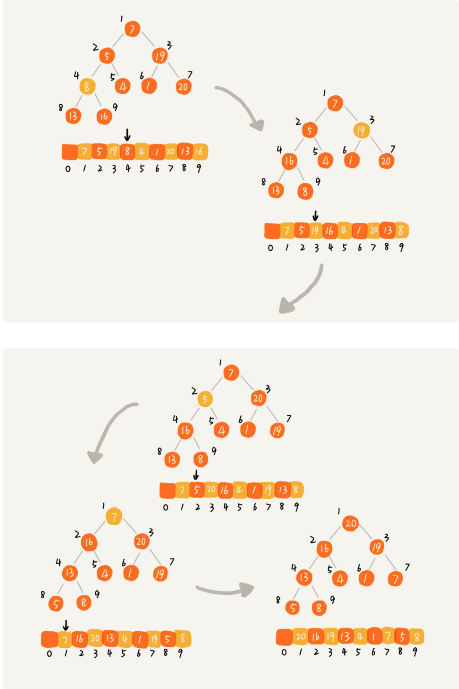

# Fork/Join

## 分治任务

* [线程池](thread-pool.md) + [Future](future.md)：可以解决简单的并行任务。
* [CompletableFuture](completablefuture.md)：可以解决有聚合关系的任务，AND 聚合或 OR 聚合。
* [CompletionService](completionservice.md)：可以解决批量的并行任务。


上述三种情况可以覆盖日常生活中的大多数并发场景，但是还有一种任务模型，**分治**。

分治指的是把一个复杂的问题分解成多个相似的子问题，然后再把子问题分解成更小的子问题，知道子问题简单到可以直接求解。比如归并排序、快速排序、二分查找、MapReduce。

分治任务模型有两个阶段：

* **任务分解**：任何和分解后的子任务具有相似性，体现在解决算法是相同的，只是数据规模不同。一般采用递归算法。
* **结果合并**。


Java 并发包提供了 Fork/Join 的并行框架来解决分治的任务模型。

## Fork/Join 框架

**Fork 对应任务的分解，Join 对应结果的合并**。这个框架主要有两部分：

* **ForkJoinPool**：工作的线程池。
* **ForkJoinTask**：分治任务。

两者的关系可以类比为 ThreadPoolExecutor 和 Runnable。

### ForkJoinTask



下面部分源码（Java 1.8）：

```java
public abstract class ForkJoinTask<V> implements Future<V>, Serializable {
    public final ForkJoinTask<V> fork() {
        Thread t;
        if ((t = Thread.currentThread()) instanceof ForkJoinWorkerThread)
            ((ForkJoinWorkerThread)t).workQueue.push(this);
        else
            ForkJoinPool.common.externalPush(this);
        return this;
    }

    public final V join() {
        int s;
        if ((s = doJoin() & DONE_MASK) != NORMAL)
            reportException(s);
        return getRawResult();
    }
}

public abstract class RecursiveTask<V> extends ForkJoinTask<V> {
    protected abstract V compute();
}

public abstract class RecursiveAction extends ForkJoinTask<Void> {
    protected abstract void compute();
}
```

* fork\(\) 方法会异步地执行一个子任务。
* join\(\) 方法会阻塞当前线程来等待子任务的执行结果。
* 两个子类都是抽象类，在使用的时候需要实现 compute\(\) 方法。
* 根据子类的名称就可看出使用递归的方式来处理任务。

### ForkJoinPool

ForkJoinPool 与 ThreadPoolExecutor 一样，本质上是一个生产者-消费者模型，只是更加智能。ThreadPoolExecutor 只有一个任务队列，而 ForkJoinPool 有多个任务队列。使用 invoke\(\) 或 submit\(\) 方法时，会根据一定的路由规则把任务给到其中的一个队列。任务在执行过程中创建的子任务会提交到工作线程对应的任务队列。

**任务窃取**：如果工作线程空闲了，那么它会窃取其它工作任务队列里面的任务。任务队列采用**双端队列**，工作线程正常获取任务和窃取任务是从不同的端拿的，以减少数据竞争。



Java 1.8 中的 parallelStream 也是以 ForkJoinPool 为基础的，默认情况下所有的并行流都共享一个 ForkJoinPool，这个共享的 ForkJoinPool 线程数是 CPU 的核数。如果并行流是计算密集型的话没什么问题；若是 IO 密集型的话，很容易拖慢整个系统的性能。建议用不同的 ForkJoinPool 执行不同的计算任务。


## 案例

### 斐波那契数列

```java
public static void main(String[] args) {
    System.out.println(new ForkJoinPool(4).invoke(new FibonacciTask(30)));
}

private static final class FibonacciTask extends RecursiveTask<Integer> {
    private final int n;
    private FibonacciTask(int n) {
        this.n = n;
    }
    @Override
    protected Integer compute() {
        if (n <= 1) {
            return n;
        }
        return new FibonacciTask(n - 1).compute() + new FibonacciTask(n - 2).fork().join();
    }
}
```

